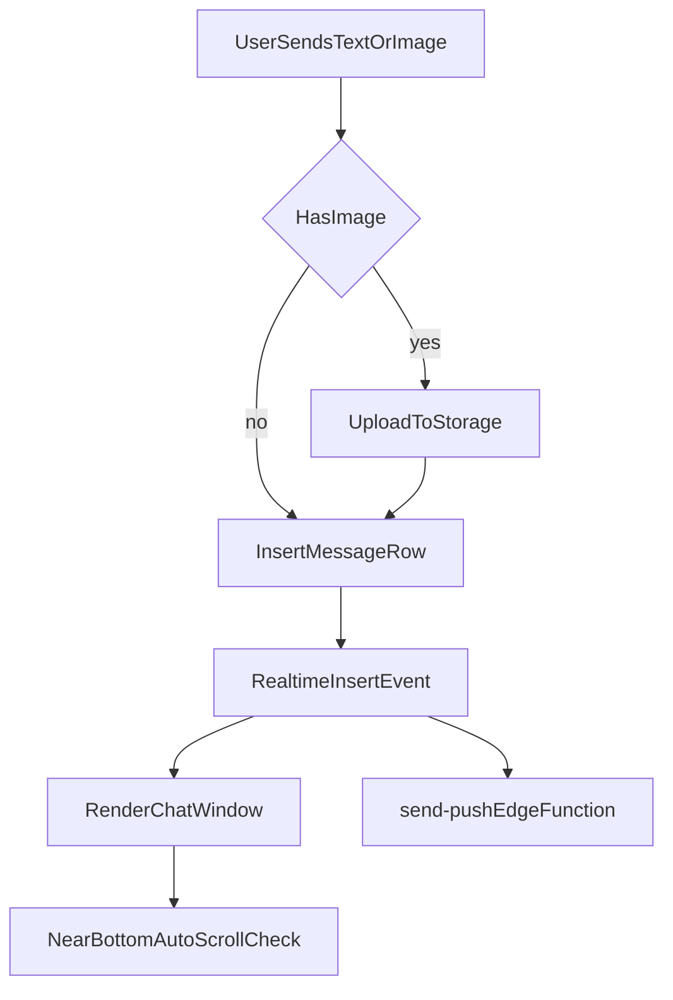

# Chat UX + Hebrew Rollout Plan

## Goals
- Keep new messages visible automatically unless the user intentionally reads older messages.
- Fix online/offline status so active users show as online reliably.
- Convert visible UI text to Hebrew and set RTL-friendly layout.
- Attempt push-notification enablement automatically on app entry (with browser-permission constraints).
- Support uploading/sending images as chat messages.
- Improve message color differentiation for users other than "me".

## Key Files To Change
- [src/components/ChatWindow.jsx](src/components/ChatWindow.jsx)
- [src/pages/DashboardPage.jsx](src/pages/DashboardPage.jsx)
- [src/components/UserList.jsx](src/components/UserList.jsx)
- [src/pages/AuthPage.jsx](src/pages/AuthPage.jsx)
- [src/App.jsx](src/App.jsx)
- [src/styles/app.css](src/styles/app.css)
- [src/lib/pushNotifications.js](src/lib/pushNotifications.js)
- [supabase/schema.sql](supabase/schema.sql)
- [supabase/functions/send-push/index.ts](supabase/functions/send-push/index.ts)

## Implementation Outline

### 1) Auto-scroll behavior in chat
- In `ChatWindow`, add a ref for the messages container and detect whether the user is near the bottom.
- On new messages:
  - If user is at/near bottom, auto-scroll to bottom.
  - If not, preserve scroll position and optionally show a small "new messages" hint/button.
- Ensure initial load scrolls to bottom once.

### 2) Fix online/offline presence
- Update presence tracking so `UserList` checks online users by tracked `user_id` from presence metas (not only presence-state object keys).
- Keep track payload as `{ user_id, online_at }`, then build `onlineUserIds` from metas for reliability.
- Validate this against current implementation in `DashboardPage` where object keys may not equal actual user IDs.

### 3) Hebrew UI + RTL layout
- Translate static UI strings in `AuthPage`, `DashboardPage`, `ChatWindow`, and `UserList` to Hebrew.
- Set document direction/language (`dir='rtl'`, `lang='he'`) at app root level.
- Adjust CSS for RTL-friendly spacing/alignment where needed (headers, chat form, user list, message metadata).
- Keep code identifiers in English; only user-facing content changes.

### 4) Auto-enable notifications (best effort)
- Trigger push registration automatically after login/dashboard mount (instead of requiring button click only).
- Keep graceful fallback when permission is denied/blocked; show concise Hebrew status text.
- Retain manual retry button for users who initially deny permission.
- Note: browser security still requires user permission; "forced" enable is not possible.

### 5) Add image upload in chat messages
- Extend `messages` model to support image messages (e.g., optional `image_url` + optional `content`, with a check ensuring at least one exists).
- Add storage bucket/policies for chat images in `schema.sql` (similar to avatar policies but scoped per user folder).
- In `ChatWindow`, add file input + upload flow to Supabase Storage, then insert message row with `image_url`.
- Render image previews/messages safely in chat feed with constrained dimensions.
- Update push notification payload text for image-only messages (e.g., "שלח תמונה").

### 6) Distinct message colors per sender
- Compute deterministic color class from sender `user_id` (excluding current user style).
- Add several non-conflicting color variants in CSS for message borders/background accents.
- Apply class in `ChatWindow` so each user gets a stable, recognizable color.

## Data/Flow Sketch

## Validation Plan
- Send several text messages while scrolled up/down; verify expected auto-scroll behavior.
- Open two sessions/users and confirm online/offline updates in near real time.
- Review major screens for Hebrew strings and RTL layout consistency.
- Test notification flow in fresh browser profile (prompt, grant, deny, retry).
- Upload image messages (jpeg/png/webp), verify rendering and storage URL behavior.
- Confirm different users consistently render with different chat colors.