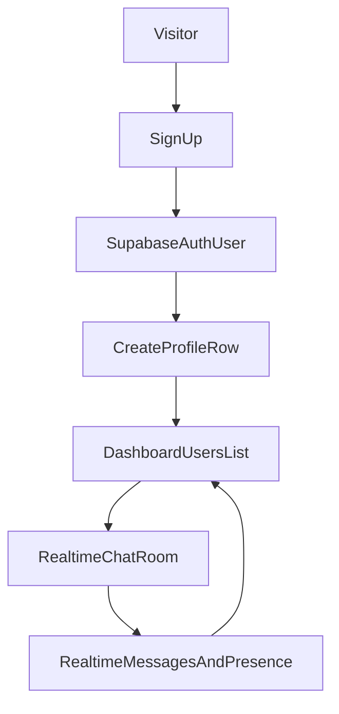

# React + Supabase Chat on Netlify

## Goal
Create a modern web chat app where users can sign up, set name and profile picture, appear in the dashboard immediately after signup, and chat in realtime. The app is hosted on Netlify free tier.

## Architecture Choice
- **Frontend**: React + Vite (deploy static assets to Netlify)
- **Backend services**: Supabase (Auth, Postgres, Realtime, Storage)
- **Reason**: Netlify free is best for static frontends; Supabase handles login, DB, file uploads, and realtime without running your own server.

## Core Features to Implement
- Authentication (email/password signup + login)
- User profile setup (display name + avatar upload)
- Dashboard user list that updates when a new user signs up
- Realtime chat room (single room to start, scalable later)
- Basic online/offline presence indicator
- Clean responsive UI

## Data Model (Supabase)
- `profiles`
  - `id` (uuid, references `auth.users.id`)
  - `display_name` (text)
  - `avatar_url` (text)
  - `created_at` (timestamp)
- `messages`
  - `id` (bigint or uuid)
  - `user_id` (uuid, references `profiles.id`)
  - `content` (text)
  - `created_at` (timestamp)
- Optional `presence` via Supabase Realtime Presence channels (no extra table required for v1)

## App Flow

## Implementation Steps
1. **Project setup**
   - Initialize React + Vite app and UI foundation.
   - Add Supabase client SDK and environment variable handling.
2. **Supabase setup**
   - Create project, configure Auth (email/password), create tables and RLS policies.
   - Create storage bucket for profile pictures.
3. **Auth + profile onboarding**
   - Build signup/login pages.
   - On first login, upsert profile row; upload avatar to Supabase Storage.
4. **Dashboard realtime users list**
   - Query `profiles` for initial list.
   - Subscribe to `profiles` insert/change events so new users appear immediately.
5. **Realtime chat**
   - Insert messages into `messages`.
   - Subscribe to new message events and render in chronological order.
6. **Presence and UX polish**
   - Track active users with Realtime Presence.
   - Add loading, empty states, error toasts, and responsive styling.
7. **Deployment to Netlify**
   - Build settings, env vars, SPA redirect config, and production verification.

## Planned File Structure
- `[src/main.jsx](src/main.jsx)` (app bootstrap)
- `[src/App.jsx](src/App.jsx)` (routing shell)
- `[src/lib/supabase.js](src/lib/supabase.js)` (Supabase client)
- `[src/pages/AuthPage.jsx](src/pages/AuthPage.jsx)`
- `[src/pages/DashboardPage.jsx](src/pages/DashboardPage.jsx)`
- `[src/components/ProfileSetupModal.jsx](src/components/ProfileSetupModal.jsx)`
- `[src/components/UserList.jsx](src/components/UserList.jsx)`
- `[src/components/ChatWindow.jsx](src/components/ChatWindow.jsx)`
- `[src/styles/app.css](src/styles/app.css)`
- `[netlify.toml](netlify.toml)`
- `[.env.example](.env.example)`

## Netlify Free Hosting Instructions and Notes
- Build command: `npm run build`
- Publish directory: `dist`
- Environment vars in Netlify dashboard:
  - `VITE_SUPABASE_URL`
  - `VITE_SUPABASE_ANON_KEY`
- Add SPA redirect so refresh on nested routes works:
  - `/* /index.html 200` (via `netlify.toml` or `_redirects`)
- In Supabase Auth URL config:
  - Set `Site URL` to your Netlify domain
  - Add `Redirect URLs` for local dev and production
- Free-tier notes:
  - Suitable for ~20 concurrent users for MVP.
  - Watch Supabase free limits (DB/storage/realtime quotas).
  - Optimize avatar size/compression to reduce bandwidth/storage.
  - Keep chat retention modest (e.g., pagination or last N messages).

## Testing and Validation
- Verify signup creates `auth.users` and `profiles` row.
- Verify new signup appears in other users’ dashboard without refresh.
- Verify avatar upload and display across sessions.
- Verify message send/receive realtime between multiple browsers.
- Verify mobile/responsive layout and route refresh on Netlify.
